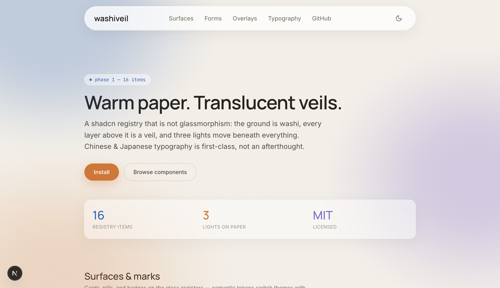
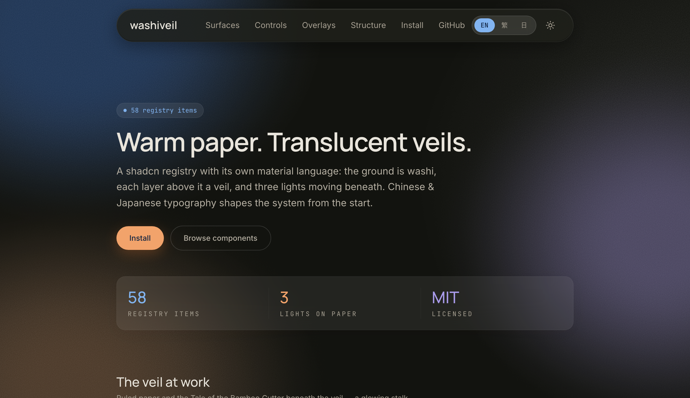

# washiveil

Warm washi paper, translucent veils. A [shadcn](https://ui.shadcn.com) registry with
first-class Chinese & Japanese typography.

Not glassmorphism. The ground is paper — a warm, grained washi surface — and every
layer above it is a veil: translucent white in light mode, a lifted warm dark (never
a white haze) in dark mode. Three lights move beneath everything.




## Install

Every component pulls the token layer (`theme`) automatically.

```bash
npx shadcn@latest add https://washiveil.alexchih.com/r/glass-card.json
```

Works in any shadcn-initialized project (Tailwind CSS v4). The components read two
token layers: standard shadcn semantic variables, plus the washi extension
(`--glass*`, tri-color accents) installed by the theme item.

## Components

| Item | What it is |
| --- | --- |
| `theme` | The full token layer — washi ground, glass veils, tri-color, light + dark |
| `ambient-field` | Viewport-fixed tri-color light field (WebGL + CSS fallback + film grain) |
| `glass-nav` | Floating glass pill nav — sliding hover pill, scroll-adaptive contrast, mobile sheet |
| `theme-toggle` | Dark-mode toggle with no-flash pre-paint script |
| `glass-card` | The base translucent surface |
| `glass-button` | Pill button — korozen primary, quiet secondary, ruri tinted |
| `chip` | Taxonomy pill in the tri-color hues |
| `stat-strip` | Three-up stat band with tri-colored numerals |
| `status-badge` | Live-status pill with pulse dot |
| `code-badge` | Mono identifier badge |
| `glass-toc` | On-this-page navigation card |
| `glass-input` / `glass-textarea` / `glass-label` | Form fields on glass |
| `glass-select` / `glass-switch` / `glass-checkbox` / `glass-radio-group` / `glass-slider` | The full control set, ruri-accented |
| `glass-dialog` / `glass-sheet` / `glass-alert-dialog` | Modals and sheets as floating veils |
| `glass-popover` / `glass-dropdown-menu` / `glass-hover-card` / `glass-tooltip` | Floating panels on strong glass |
| `glass-sonner` | Toasts as small veils |
| `glass-tabs` / `glass-accordion` / `glass-table` / `glass-separator` / `glass-alert` | Structure in the editorial register |
| `glass-skeleton` / `glass-progress` / `glass-avatar` | Quiet states |
| `glass-breadcrumb` / `glass-pagination` | Quiet wayfinding |
| `glass-context-menu` / `glass-menubar` / `glass-navigation-menu` | The full menu family on strong glass |
| `glass-toggle` / `glass-toggle-group` / `glass-collapsible` / `glass-scroll-area` / `glass-aspect-ratio` | Utility primitives |
| `glass-command` / `glass-combobox` | cmdk palette and searchable select |
| `glass-calendar` / `glass-date-picker` | day-picker themed to the washi ground |
| `glass-form` | react-hook-form wiring in the house registers |
| `glass-drawer` / `glass-input-otp` | Rising veil drawer (Vaul), OTP cells on glass |
| `glass-kbd` / `glass-spinner` / `glass-empty` | Small states and marks |
| `share-row` | URL-intent share row — no SDKs, no trackers |

## The tri-color

Three accents, named after their nearest Japanese traditional colors. Values are
tuned for contrast on the washi ground; the lineage is the point, not a spectral match.

| Token | Value | Named after | Nearest match |
| --- | --- | --- | --- |
| `ruri` | `#2e63b8` | 瑠璃 — lapis lazuli blue | ΔE 7.8 to 瑠璃色 `#1e50a2` |
| `korozen` | `#d0722e` | 黄櫨染 — the emperor's enthronement robe, once forbidden to everyone else | ΔE 7.8 to 黄櫨染 `#d66a35` |
| `sumire` | `#7b68c8` | 菫 — the violet flower | ΔE 13 to 菫色 `#7058a3` — brightened well past the classical dye |

## Chinese & Japanese, first-class

- Font stacks lead with a Latin face and unify zh/ja glyph forms via Noto CJK
  (Han unification: 直/骨/海 render differently in TC and JP — the stack order matters)
- `text-wrap: balance` on display text; Japanese headings break at phrase
  boundaries (`word-break: auto-phrase`, progressive enhancement)
- Full-width punctuation conventions respected throughout the demo copy

## Roadmap

Deferred deliberately, not forgotten: `glass-carousel`, `glass-resizable`,
charts, sidebar, and blocks (hero, pricing, article) — heavy dependencies
or low glass leverage, revisited on demand.

## Design story

The palette and its three lights have an origin story — read it at
[alexchih.com](https://alexchih.com) (link lands with the launch post).

## License

MIT © [Alex Chih](https://alexchih.com)
